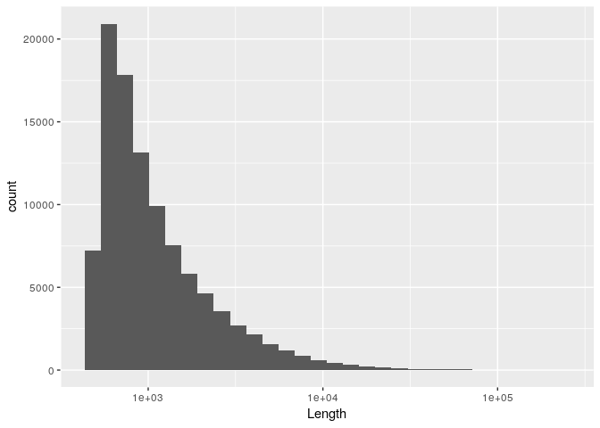
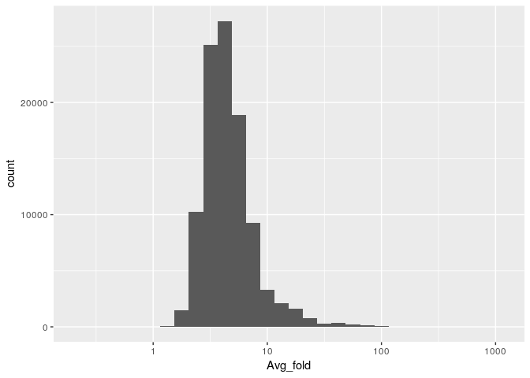
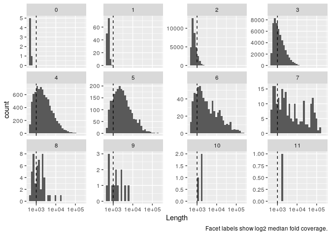
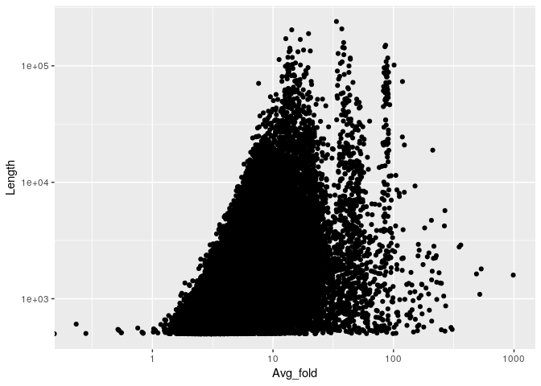

Metagenomic contigs coverage
================
Taavi Päll
2019-04-26

  - Can we filter contigs based on coverage?

Load libraries.

``` r
library(tidyverse)
```

Importing test data.

``` r
con <- read_csv("SRR5580016_coverage.txt")
```

    ## Parsed with column specification:
    ## cols(
    ##   `#ID` = col_character(),
    ##   Avg_fold = col_double(),
    ##   Length = col_double(),
    ##   Ref_GC = col_double(),
    ##   Covered_percent = col_double(),
    ##   Covered_bases = col_double(),
    ##   Plus_reads = col_double(),
    ##   Minus_reads = col_double(),
    ##   Read_GC = col_double(),
    ##   Median_fold = col_double(),
    ##   Std_Dev = col_double()
    ## )

Contigs length distribution.

``` r
con %>% 
  ggplot() +
  geom_histogram(aes(Length), bins = 30) +
  scale_x_log10()
```

<!-- -->

Contigs Avg\_fold distribution.

``` r
con %>% 
  ggplot() +
  geom_histogram(aes(Avg_fold), bins = 30) +
  scale_x_log10()
```

    ## Warning: Transformation introduced infinite values in continuous x-axis

    ## Warning: Removed 1 rows containing non-finite values (stat_bin).

<!-- -->

Contigs length distribution in Median\_fold log2 bins. Threshold could
be set between 4+ (2^2) and 8 (2^3) fold coverage.

``` r
con_cov <- con %>% 
  mutate(fold = ceiling(log2(1 + con$Median_fold)))

ggplot(data = con_cov) +
  geom_histogram(aes(Length), bins = 30) +
  facet_wrap(~ fold, scales = "free_y") +
  geom_vline(xintercept = 1000, linetype = "dashed") +
  scale_x_log10() +
  labs(caption = "Facet labels show log2 median fold coverage.")
```

<!-- -->

Retention of contigs when filtered by coverage.

``` r
con_cov %>% 
  count(fold) %>% 
  mutate(cum_n = cumsum(n),
         remain = sum(n) - cum_n)
```

    ## # A tibble: 12 x 4
    ##     fold     n  cum_n remain
    ##    <dbl> <int>  <int>  <int>
    ##  1     0     6      6 101303
    ##  2     1   135    141 101168
    ##  3     2 35697  35838  65471
    ##  4     3 53595  89433  11876
    ##  5     4  8473  97906   3403
    ##  6     5  2418 100324    985
    ##  7     6   702 101026    283
    ##  8     7   218 101244     65
    ##  9     8    48 101292     17
    ## 10     9    13 101305      4
    ## 11    10     3 101308      1
    ## 12    11     1 101309      0

Contig length versus Avg\_fold coverage.

``` r
con %>% 
  ggplot() +
  geom_point(aes(Avg_fold, Length)) +
  scale_y_log10() +
  scale_x_log10()
```

    ## Warning: Transformation introduced infinite values in continuous x-axis

<!-- -->
